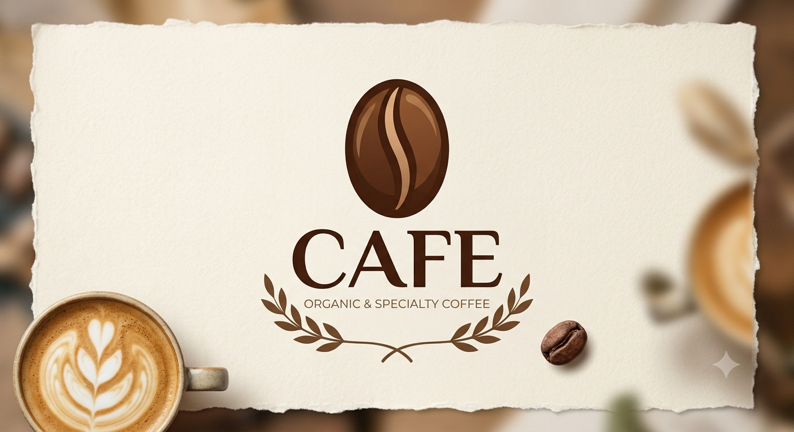

# 🏪 Bloom Cafe & Restaurant Management System

A premium, enterprise-grade Point of Sale (POS) and Kitchen Display System (KDS) built specifically for modern cafes and restaurants. Featuring a highly responsive, touch-friendly UI inspired by top-tier SaaS platforms like Toast POS and Square.



**Live Demo**: [https://pos-radheee.vercel.app/](https://pos-radheee.vercel.app/)

## ✨ Features

- **Omnichannel Order Management**: Seamlessly manage Walk-ins and Takeaway orders.
- **Real-Time Kitchen Display System (KDS)**: Dedicated, distraction-free screen for kitchen staff to manage active prep times and fulfill orders efficiently.
- **Customer Waiting Display**: A beautifully designed, high-visibility timeline screen (readable from 15+ feet away) to alert customers when their food is Ready.
- **Intelligent Global Search**: Instantly find any order globally across the application by Order ID or Item Name from the omnipresent navigation bar.
- **Premium Aesthetics**: Features a meticulously designed UI with smooth micro-animations, glassmorphism, dynamic shadow depths, and fully integrated Dark & Light modes.
- **Offline-First Resilience**: Powered by React Context and LocalStorage to ensure the business never stops running, even if the internet goes down.

## 💻 Tech Stack

- **Framework**: Next.js 16 (App Router)
- **Language**: TypeScript
- **Styling**: Tailwind CSS v4
- **UI Primitives**: Base UI & shadcn/ui
- **Icons**: Lucide React
- **Date Formatting**: date-fns

## 🚀 Getting Started

First, install the dependencies:

```bash
npm install
```

Then, run the development server:

```bash
npm run dev
```

Open [http://localhost:3000](http://localhost:3000) with your browser to see the application.

## 📱 Responsiveness

The application is fully responsive. It automatically scales its grid layout from 1 to 4 columns depending on the screen width. It transforms into compact views for mobile devices while maintaining its premium look and feel. 

